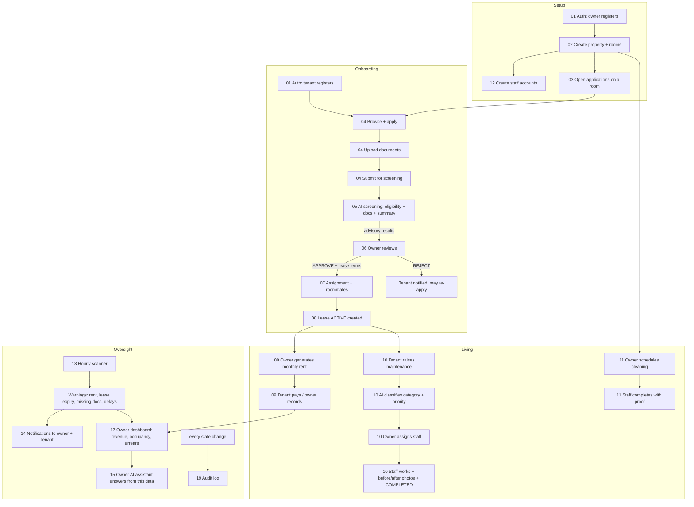

# 00 · End-to-end: the whole lifecycle

How the individual workflows chain together, from an empty system to a running tenancy
with rent, maintenance and warnings.



## The critical separation

Steps **05** (AI screening) and **06** (owner decision) are deliberately distinct:

| Step | Who | Output |
| --- | --- | --- |
| 05 | AI service | advisory score / recommendation / warnings — **changes nothing** |
| 06 | Owner (human) | `APPROVED` or `REJECTED` — the **only** decision point |

The AI never approves or rejects. See [16 · AI fallback](16-ai-fallback.md) for how
the advisory result is produced (NVIDIA NIM, or rule-based "Criteria Match %").

## Try it end-to-end

```bash
npm start          # Postgres + backend + frontend + AI service
```

Then, signed in as the seeded accounts (password `Password123`):

1. **owner@srms.test** — create a property & room, open applications.
2. **tenant@srms.test** — browse, apply, upload 3 docs, submit for screening.
3. **owner@srms.test** — open the application, read the AI results, approve with lease terms.
4. **tenant@srms.test** — see the room, roommates, lease, food on the dashboard; pay rent.
5. **tenant2@srms.test** — raise a maintenance request (already has overdue rent seeded).
6. **owner@srms.test** — assign it to **maintenance@srms.test**; run the AI assistant ("Which tenants have overdue rent?"); run a warning scan.
7. **maintenance@srms.test** — progress the task, upload an AFTER photo, complete it.

`scripts/../smoke test` in the repo history exercises exactly this path via the API.
