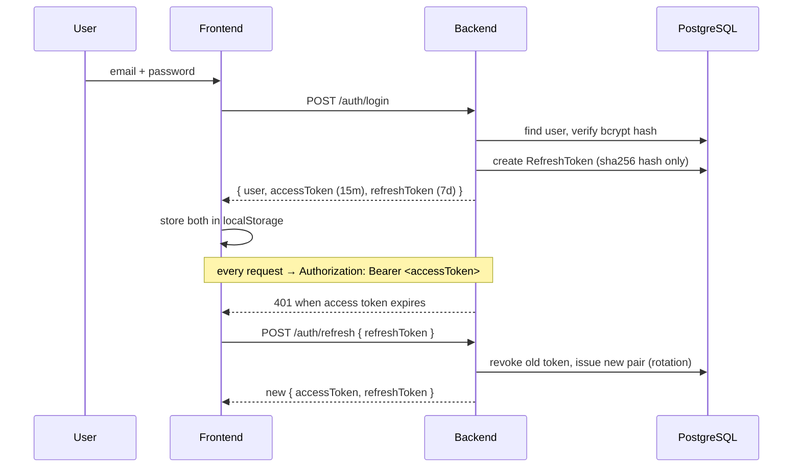

# 01 · Authentication & sessions

**Actors:** anyone (Owner, Tenant self-register; Staff created by Owner — see [12](12-staff-management.md))
**Code:** `backend/src/modules/auth/*`, `backend/src/lib/auth.ts`, `backend/src/middleware/authenticate.ts`, `authorize.ts`
**Frontend:** `frontend/src/pages/Login.tsx`, `Register.tsx`, `frontend/src/lib/auth.tsx`, `lib/api.ts`

---

## Overview

## Registration `[public]`

`POST /auth/register` — body `{ email, password, fullName, phone?, role? }`

- `role` may only be `OWNER` or `TENANT` (default `TENANT`). `STAFF` is rejected — staff accounts are created by an owner.
- Password policy: 8–128 chars, at least one lowercase, one uppercase, one digit (`auth.schema.ts`).
- Email is lowercased and must be unique → `409 CONFLICT` otherwise.
- On success the user is created and a session is issued immediately (same shape as login).
- Audit: `auth.register`.

## Login `[public]`

`POST /auth/login` — body `{ email, password }`

- Generic `401` (`Invalid email or password`) whether the email is unknown, the password is wrong, or the account is inactive — no user enumeration.
- Rate limited: 20 attempts / 15 min / IP (`authLimiter`).
- Returns `{ user, accessToken, refreshToken }`.
- Audit: `auth.login`.

## Tokens

| Token | Lifetime | Storage | Notes |
| --- | --- | --- | --- |
| Access (JWT) | `JWT_ACCESS_EXPIRES` (15m) | client `localStorage` | claims: `sub`, `email`, `role`, `name` |
| Refresh (opaque random 48 bytes, base64url) | `JWT_REFRESH_EXPIRES` (7d) | **only its SHA-256 hash** in `RefreshToken` | rotated on every use |

A DB leak of `RefreshToken` rows cannot mint sessions — only hashes are stored.

## Refresh & rotation

`POST /auth/refresh` — body `{ refreshToken }`

1. Look up by `sha256(token)`.
2. Reject if missing, revoked, expired, or the user is inactive → `401`.
3. **Revoke the used token** (`revokedAt = now`).
4. Issue a fresh access + refresh pair.

The frontend axios interceptor (`lib/api.ts`) does this automatically on the first
`401`, retries the original request once, and de-duplicates concurrent refreshes
with a single in-flight promise. If refresh fails it clears tokens and redirects to `/login`.

## Logout

| Endpoint | Effect |
| --- | --- |
| `POST /auth/logout` `{ refreshToken }` | revokes that one session |
| `POST /auth/logout-all` `[authenticated]` | revokes **all** the user's non-revoked refresh tokens. Audit `auth.logout_all`. |

## Change password

`POST /auth/change-password` `[authenticated]` — body `{ currentPassword, newPassword }`

- Verifies `currentPassword` → `401` if wrong.
- Re-hashes and stores the new password.
- **Revokes every session** (all refresh tokens) — the user must sign in again everywhere.
- Audit: `auth.change_password`.

## Request authentication (every protected route)

`authenticate` middleware:

1. Requires `Authorization: Bearer <jwt>` → `401` if absent.
2. Verifies the JWT signature/expiry → `401` on failure.
3. Re-loads the user from the DB on **every request** and checks `isActive` → `401` if the account was deactivated.
4. Attaches `req.user = { id, email, role, fullName }`.

`optionalAuthenticate` does the same but never fails — used where a route is nicer with a user but works without one.

## Authorization (RBAC)

`authorize(...roles)` runs after `authenticate`:

- `401` if no `req.user`.
- `403 FORBIDDEN` (`Requires role: X or Y`) if `req.user.role` isn't in the list.

Route groups are role-locked at the router level, e.g. `ownerApplicationRoutes.use(authenticate, authorize('OWNER'))`. Ownership of the specific record is then checked in the service layer (see [`lib/access.ts`](../../backend/src/lib/access.ts)).

## Edge cases

| Situation | Result |
| --- | --- |
| Expired access token, valid refresh | transparent refresh + retry (frontend) |
| Expired/revoked refresh token | `401`, tokens cleared, redirect to login |
| Account deactivated mid-session | next request → `401` (DB check in `authenticate`) |
| Password changed elsewhere | all other sessions invalidated on next request |
| 21st login attempt in 15 min | `429 RATE_LIMITED` |
| Register with existing email | `409 CONFLICT` |
| Register with `role: "STAFF"` | `400` validation error |
