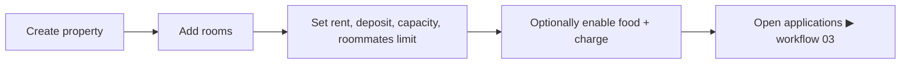

# 02 · Property & room setup

**Actors:** Owner
**Code:** `backend/src/modules/properties/*`, `backend/src/modules/rooms/*`
**Frontend:** `frontend/src/pages/owner/OwnerProperties.tsx`

---

## Overview



An **owner** owns **properties**; each property has **rooms**. Rent, deposit,
capacity, roommate limit and food are configured per room (food can also be set at
the property level — see [18](18-food-option.md)).

## Create a property `[OWNER]`

`POST /owner/properties`

```json
{
  "name": "Maple Residency",
  "addressLine1": "12 Maple Street",
  "addressLine2": null,
  "city": "Bengaluru",
  "state": "Karnataka",
  "postalCode": "560001",
  "country": "India",
  "description": "Co-living building near the tech park.",
  "foodEnabled": true,
  "foodCharge": 3000
}
```

- `name`, `addressLine1`, `city` required; everything else optional.
- `foodEnabled` / `foodCharge` default to `false` / `0`.
- Audit: `property.create`.

## List / view

| Endpoint | Notes |
| --- | --- |
| `GET /owner/properties?search=&isActive=&page=&pageSize=` | each row includes `roomCount`, `totalCapacity`, `totalOccupants`, `openForApplications` |
| `GET /owner/properties/:id` | includes all rooms with `_count` of applications & assignments |

Ownership is enforced: `ownerPropertyOrThrow` → `404` if not found, `403` if another owner's.

## Update a property `[OWNER]`

`PATCH /owner/properties/:id` — any subset of the create fields, plus `isActive`.
Audit: `property.update`.

## Deactivate a property `[OWNER]`

`DELETE /owner/properties/:id` — **soft delete** (no data loss):

```
transaction:
  all rooms in property → status INACTIVE, applicationsOpen = false
  property → isActive = false
```

Audit: `property.deactivate`. Deactivated properties are hidden from tenant browse.

## Add a room `[OWNER]`

`POST /owner/rooms`

```json
{
  "propertyId": "cuid...",
  "name": "Room 101",
  "floor": "1",
  "description": null,
  "monthlyRent": 15000,
  "securityDeposit": 30000,
  "capacity": 2,
  "roommatesLimit": 2,
  "foodEnabled": true,
  "foodCharge": 3000,
  "amenities": ["AC", "Attached bathroom", "Wi-Fi"]
}
```

Rules:

- Owner must own `propertyId` (`ownerPropertyOrThrow`).
- `roommatesLimit` **must not exceed** `capacity` → `400`.
- New room starts `status = AVAILABLE`, `applicationsOpen = false`, `occupantCount = 0`.
- Audit: `room.create`.

## Update a room `[OWNER]`

`PATCH /owner/rooms/:id` — subset of create fields (minus `propertyId`), plus `status`.

Guards:

| Check | Result |
| --- | --- |
| `roommatesLimit > capacity` | `400` |
| new `capacity < occupantCount` | `409 CONFLICT` — can't shrink below current occupants |
| `status` not provided | status is auto-derived from occupancy (`AVAILABLE` / `OCCUPIED` / `FULL`) |

Audit: `room.update`.

## Room status model

| Status | Meaning | Set by |
| --- | --- | --- |
| `AVAILABLE` | 0 occupants | auto |
| `OCCUPIED` | 1..capacity-1 occupants | auto |
| `FULL` | occupants == capacity | auto |
| `INACTIVE` | withdrawn from use | owner / property deactivation |

`occupantCount` and `status` are recomputed inside a transaction whenever an
assignment is created or ended ([07](07-assignment-roommates.md), [08](08-leases.md)).

## Remove a room `[OWNER]`

`DELETE /owner/rooms/:id` — sets `status = INACTIVE`, `applicationsOpen = false`.
**Blocked** (`409`) if `occupantCount > 0` — end the tenancies first.

## Edge cases

| Situation | Result |
| --- | --- |
| Add room with `roommatesLimit` 3, `capacity` 2 | `400` |
| Shrink capacity below occupants | `409` |
| Delete an occupied room | `409` |
| Deactivate property with occupied rooms | allowed — rooms go `INACTIVE`, tenancies untouched (end them via [07](07-assignment-roommates.md)) |
| Another owner requests your property/room | `403` |
