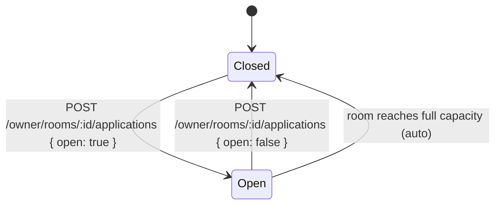

# 03 · Opening & closing applications

**Actors:** Owner
**Code:** `backend/src/modules/rooms/rooms.service.ts` → `setApplicationsOpen`
**Frontend:** `frontend/src/pages/owner/OwnerProperties.tsx` (the "Open / Closed" toggle)

---

## Overview

A room only accepts tenant applications while `applicationsOpen = true`. The owner
toggles this per room.



## Open applications `[OWNER]`

`POST /owner/rooms/:id/applications` — body `{ "open": true }`

Guards (`setApplicationsOpen`):

| Check | Result |
| --- | --- |
| Owner doesn't own the room | `403` |
| `room.status === INACTIVE` | `409 CONFLICT` — "Cannot open applications on an inactive room" |
| `occupantCount >= capacity` | `409 CONFLICT` — "Room is at full capacity; free a bed before opening applications" |

On success: `applicationsOpen = true`. Audit: `room.applications_open`.

## Close applications `[OWNER]`

`POST /owner/rooms/:id/applications` — body `{ "open": false }`

No guards — always allowed. `applicationsOpen = false`. Audit: `room.applications_close`.

Existing in-flight applications are **not** cancelled by closing — the owner still
reviews and decides on them ([06](06-owner-review-decision.md)). Closing only stops
*new* applications.

## Automatic close on full

When an assignment is created and the room reaches `occupantCount == capacity`,
`recomputeRoomOccupancy` sets `applicationsOpen = false` automatically
(`assignments.service.ts`). The owner can re-open later if a bed frees up.

## Effect on tenant browse

`GET /tenant/rooms` only returns rooms where:

```
applicationsOpen = true
AND status IN (AVAILABLE, OCCUPIED)
AND property.isActive = true
```

So closing a room's applications removes it from every tenant's browse list
immediately ([04](04-tenant-application.md)).

## Edge cases

| Situation | Result |
| --- | --- |
| Open applications on a full room | `409` |
| Open applications on an inactive room | `409` |
| Close applications with pending applications | allowed; pending apps continue through review |
| Room auto-fills | `applicationsOpen` flips to `false` automatically |
| Tenant tries to apply the instant after close | `409 CONFLICT` — "Applications are not open for this room" |
