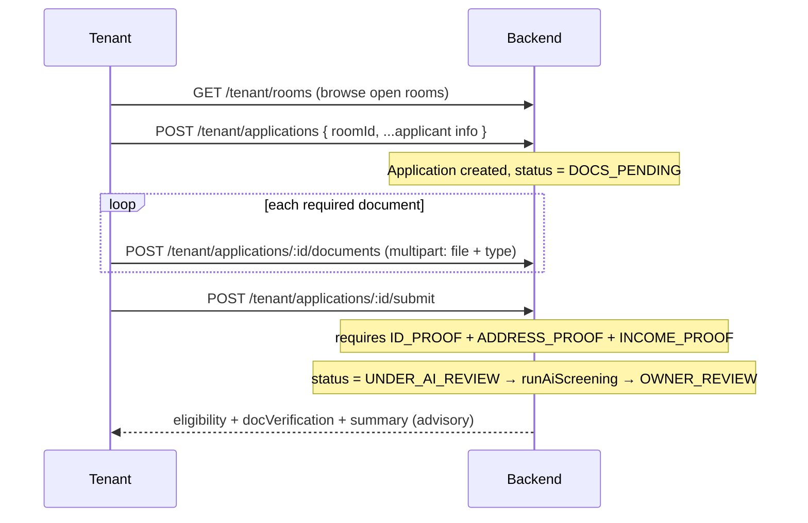

# 04 · Tenant application & documents

**Actors:** Tenant
**Code:** `backend/src/modules/applications/*` (tenant half)
**Frontend:** `frontend/src/pages/tenant/TenantBrowse.tsx`, `TenantApplications.tsx`, `TenantApplicationDetail.tsx`

---

## Full sequence



## Step 1 — Browse `[TENANT]`

`GET /tenant/rooms?city=&minRent=&maxRent=&foodEnabled=&page=&pageSize=`

Returns only rooms open for applications (see [03](03-open-close-applications.md)).
Each row: rent, deposit, `spotsAvailable`, `roommatesLimit`, amenities, and
`food: { foodEnabled, foodCharge }` (the *effective* food setting — see [18](18-food-option.md)).

`GET /tenant/rooms/:id` — single room detail.

## Step 2 — Apply `[TENANT]`

`POST /tenant/applications`

```json
{
  "roomId": "cuid...",
  "monthlyIncome": 48000,
  "employmentStatus": "Salaried full-time",
  "employerName": "Acme",
  "currentAddress": "…",
  "moveInDate": "2026-10-01",
  "occupants": 1,
  "hasPets": false,
  "smoker": false,
  "notes": "…",
  "foodOptIn": true
}
```

Only `roomId` is required; `occupants` defaults to 1, booleans to `false`.

Guards (`applicationsService.apply`):

| Check | Result |
| --- | --- |
| Room not found | `404` |
| `applicationsOpen === false` | `409` — "Applications are not open for this room" |
| `room.status === INACTIVE` | `409` — "This room is not available" |
| Tenant already has an **active** application for this room | `409` — one active application per room |
| Tenant already assigned to this room | `409` |
| `occupants > room.capacity` | `400` |

`foodOptIn` is forced to `false` if food is not effectively enabled for the room.

**Result:** `Application` created with `status = DOCS_PENDING`, `submittedAt = now`.
A notification goes to the property owner ("New tenant application … Awaiting documents").
Audit: `application.create`.

> "Active" = status in `SUBMITTED`, `DOCS_PENDING`, `UNDER_AI_REVIEW`, `AI_COMPLETE`, `OWNER_REVIEW`.

## Step 3 — Upload documents `[TENANT]`

`POST /tenant/applications/:id/documents` — `multipart/form-data`

| Field | Value |
| --- | --- |
| `file` | the document (image/jpeg, png, webp, heic, or application/pdf; ≤ `MAX_UPLOAD_MB`) |
| `type` | one of `ID_PROOF`, `ADDRESS_PROOF`, `INCOME_PROOF`, `EMPLOYMENT_LETTER`, `BANK_STATEMENT`, `PHOTO`, `OTHER` |

Upload security (`middleware/upload.ts`): MIME allow-list, size cap, random stored
filename, client filename checked for `..` / `/`. Stored under
`uploads/application-documents/`, served read-only from `/uploads/<path>`.

Guards: cannot add documents once the application is finalised (`APPROVED` /
`REJECTED` / `WITHDRAWN`) — the just-uploaded file is deleted and `409` returned.

`DELETE /tenant/applications/:id/documents/:docId` — allowed only **before** screening
starts (blocked once status is `UNDER_AI_REVIEW` or later).

Each document starts `verification = PENDING`; AI screening may move it to
`INCONSISTENT` ([05](05-ai-screening.md)).

## Step 4 — Submit for screening `[TENANT]`

`POST /tenant/applications/:id/submit`

Preconditions (`submitForScreening`):

| Check | Result |
| --- | --- |
| Status not `DOCS_PENDING` or `SUBMITTED` | `409` |
| Missing any of `ID_PROOF`, `ADDRESS_PROOF`, `INCOME_PROOF` | `400` — "Upload all required documents before screening. Missing: …" |

On success:

```
Application: DOCS_PENDING → UNDER_AI_REVIEW
runAiScreening(id)   ← workflow 05
Application: UNDER_AI_REVIEW → OWNER_REVIEW
```

Response includes the freshly created `eligibility`, `docVerification`, `summary`.
The owner is notified ("AI screening complete"). Audit: `application.submit_screening`.

## Edit / withdraw `[TENANT]`

| Endpoint | When allowed | Effect |
| --- | --- | --- |
| `PATCH /tenant/applications/:id` | status `DOCS_PENDING` or `SUBMITTED` | update applicant fields |
| `POST /tenant/applications/:id/withdraw` | any non-finalised status | `status → WITHDRAWN` |

## Tenant views

| Endpoint | Returns |
| --- | --- |
| `GET /tenant/applications?status=&page=` | list with room, eligibility summary, doc-verification summary, doc count |
| `GET /tenant/applications/:id` | full detail: room+property, documents, eligibility, docVerification, summary, assignment |

The detail page shows a progress tracker: **Applied → Documents → AI screening → Owner review → Decision**.

## Edge cases

| Situation | Result |
| --- | --- |
| Apply to a room that just closed | `409` |
| Apply twice to the same room | `409` (one active application) |
| Submit without income proof | `400`, lists what's missing |
| Upload a `.exe` / oversized file | `400` (MIME / size) |
| Remove a document after screening started | `409` |
| Owner rejects, tenant re-applies | allowed (previous is `REJECTED`, not active) |
| Tenant withdraws mid-screening | `WITHDRAWN`; owner sees it, cannot decide on it |
