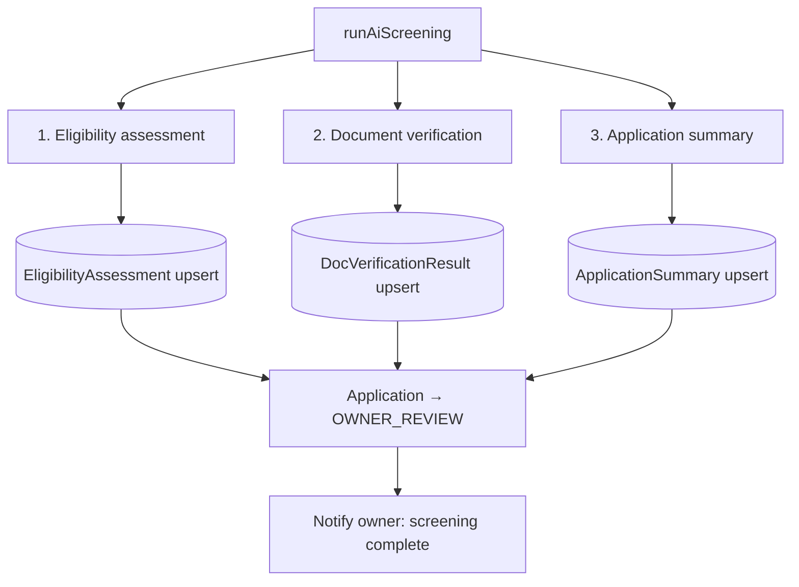

# 05 · AI screening (eligibility, documents, summary)

**Actors:** System / AI service (triggered by tenant submit or owner re-run)
**Code:** `backend/src/modules/applications/applications.service.ts` → `runAiScreening`; `backend/src/lib/aiClient.ts`; `ai-service/app/*`
**Frontend:** shown on `OwnerApplicationDetail.tsx` and `TenantApplicationDetail.tsx`

---

## Where it runs

`runAiScreening(applicationId)` is called by:

- **Tenant** `POST /tenant/applications/:id/submit` ([04](04-tenant-application.md))
- **Owner** `POST /owner/applications/:id/rerun-ai` ([06](06-owner-review-decision.md))

It runs **synchronously** within that request. Each of the three AI calls has its
own fallback, so the request always completes quickly and never fails for AI reasons.



Each backend `aiClient.*` call → AI service (`POST /ai/*`) → **NVIDIA NIM first, rule-based fallback on failure** ([16](16-ai-fallback.md)). Every result carries `source: "NVIDIA_AI" | "RULE_BASED_FALLBACK"`.

---

## 1 · Eligibility assessment

**Input** (built from the application, room, tenant, uploaded doc types):

```jsonc
{
  "applicant": { "fullName", "monthlyIncome", "employmentStatus", "employerName",
                 "occupants", "hasPets", "smoker", "notes" },
  "room": { "name", "monthlyRent", "capacity", "roommatesLimit", "foodEnabled" },
  "requiredDocuments": ["ID_PROOF", "ADDRESS_PROOF", "INCOME_PROOF"],
  "providedDocuments": ["ID_PROOF", "ADDRESS_PROOF", "INCOME_PROOF"]
}
```

**Output → `EligibilityAssessment`:**

| Field | Meaning |
| --- | --- |
| `source` | `NVIDIA_AI` or `RULE_BASED_FALLBACK` |
| `score` | 0–100 |
| `scoreLabel` | `"Advisory score"` (NVIDIA) or **`"Criteria Match"`** (fallback) |
| `recommendation` | `STRONG` / `MODERATE` / `WEAK` / `REVIEW` — advisory only |
| `reasons[]` | positive factors |
| `warnings[]` | concerns |
| `missingRequirements[]` | required docs not provided |

**Fallback scoring** (`ai-service/app/fallback.py`), weighted to a **criteria match** (not approval odds):

| Criterion | Weight | Logic |
| --- | --- | --- |
| Income-to-rent ratio | 40 | ≥3× → full; ≥2.5× → 33; ≥2× → 24; ≥1.5× → 12 + warning; else 4 + warning; no income → 8 + warning |
| Required documents | 30 | `30 × (present / required)` |
| Employment | 15 | employed/salaried → 15; self-employed/contract → 10; student/unemployed/retired → 4 + warning |
| Occupancy fit | 10 | occupants ≤ capacity → 10 (+ note if also ≤ roommate limit); else 0 + warning |
| Lifestyle | 5 | −3 smoker, −2 pets (with warnings) |

Recommendation from final score: ≥78 `STRONG`, ≥60 `MODERATE`, ≥45 `REVIEW`, else `WEAK`.

Example fallback output:

```
Criteria Match: 82%
recommendation: STRONG
reasons: ["Income is 3.2x rent (meets the 3x guideline).",
          "All required documents were provided.",
          "Applicant reports stable employment."]
warnings: []
missingRequirements: []
```

---

## 2 · Document verification

**Input:** applicant identity fields + list of `{ type, originalName }` per document + required doc list.

> OCR is out of scope. The check verifies **presence and simple consistency**, not authenticity — see [ARCHITECTURE.md](../ARCHITECTURE.md#known-simplifications).

**Output → `DocVerificationResult`:**

| Field | Meaning |
| --- | --- |
| `source` | engine |
| `overallStatus` | `PENDING` / `VERIFIED` / `INCONSISTENT` / `UNREADABLE` / `FAILED` |
| `consistencyScore` | 0–100 |
| `extractedFields` | best-effort key/value (fallback: naive keyword presence) |
| `inconsistencies[]` | e.g. "Applicant first name not found in ID_PROOF" |
| `missingDocuments[]` | required types not uploaded |

**Fallback rules:** missing required docs → `INCONSISTENT`, score `max(20, 75 − 18·missing)`;
name mismatch in provided text → `INCONSISTENT`, score 55; otherwise `PENDING`, score 70.

If `overallStatus === INCONSISTENT`, every still-`PENDING` `ApplicationDocument` is
marked `verification = INCONSISTENT`.

---

## 3 · Application summary

**Input:** applicant, room, the eligibility result, provided/missing docs.

**Output → `ApplicationSummary`:** `{ source, summary, highlights[], concerns[] }`.

**Fallback:** a templated 2–3 sentence summary plus derived highlights
(income-to-rent ratio, documents provided) and concerns (missing docs, pets, smoker,
plus any eligibility warnings).

---

## After screening

```
Application: UNDER_AI_REVIEW → OWNER_REVIEW
Notification → owner: "AI screening complete … Review and make your decision."
```

The application now waits for the owner ([06](06-owner-review-decision.md)). The AI
has **not** changed the outcome — it only produced advisory artifacts.

## Re-running

`POST /owner/applications/:id/rerun-ai` re-executes all three steps and `upsert`s
the results (overwrites the previous ones). Blocked if the application is finalised.
Audit: `application.ai_rerun`.

## Edge cases

| Situation | Result |
| --- | --- |
| NVIDIA key unset / timeout / 429 / 5xx | that step returns a `RULE_BASED_FALLBACK` result; screening still completes |
| AI service entirely unreachable | `aiClient` last-resort local fallback in the backend ([16](16-ai-fallback.md)) |
| Tenant uploaded extra optional docs | counted as provided; can only help the score |
| Re-run after owner already approved | `409` |
| Model returns malformed JSON | treated as failure → fallback for that step |
