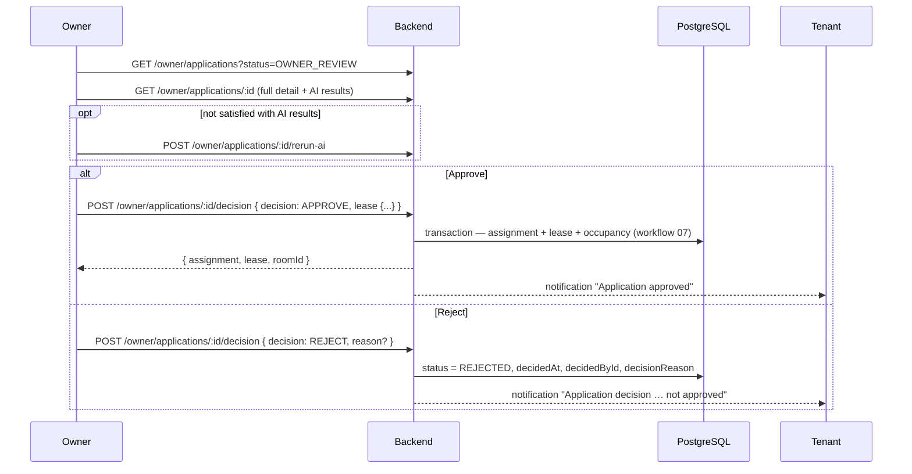

# 06 · Owner review & decision

**Actors:** Owner
**Code:** `backend/src/modules/applications/applications.service.ts` → `decide`; `assignments.service.ts` → `assignFromApplication`
**Frontend:** `frontend/src/pages/owner/OwnerApplications.tsx`, `OwnerApplicationDetail.tsx`

---

## The rule

> The owner makes the **final decision**. The AI results from [05](05-ai-screening.md)
> are advisory only. `decide` is the **only** code path that sets an application to
> `APPROVED` or `REJECTED`, and only an authenticated `OWNER` can call it.



## Review `[OWNER]`

| Endpoint | Returns |
| --- | --- |
| `GET /owner/applications?status=&roomId=&propertyId=&page=` | list; each row has tenant, room+property, eligibility, docVerification, summary, doc count |
| `GET /owner/applications/:id` | full detail via `ownerApplicationOrThrow` (403 if not the owner's) — applicant fields, all documents (with `/uploads/...` links), eligibility, docVerification, summary |

The detail page surfaces the eligibility **score + label + recommendation**, its
`reasons` / `warnings` / `missingRequirements`, the document-verification status and
inconsistencies, and the AI summary — each tagged **NVIDIA AI** or **Rule-Based Fallback**.
A banner states the results are advisory.

## Decision `[OWNER]`

`POST /owner/applications/:id/decision`

Preconditions: application must not already be `APPROVED` / `REJECTED` / `WITHDRAWN` → `409`.

### Reject

```json
{ "decision": "REJECT", "reason": "Income below the 2x threshold" }
```

Effect:

```
Application: OWNER_REVIEW → REJECTED
  decidedAt = now, decidedById = owner, decisionReason = reason (optional)
Notification → tenant: "Your application for <room> was not approved. Reason: …"
```

Audit: `application.reject`.

### Approve

```json
{
  "decision": "APPROVE",
  "reason": "Strong applicant",
  "lease": {
    "startDate": "2026-10-01",
    "endDate": "2027-09-30",
    "rentDueDay": 5,
    "monthlyRent": 15000,
    "foodOptIn": true,
    "terms": "Standard 12-month lease…"
  }
}
```

- `lease` is **required** for approval → `400` if absent.
- `lease.endDate` must be after `startDate` → `400`.
- `monthlyRent` defaults to the room's rent; `foodOptIn` defaults to the application's value; `terms` optional.

Effect — delegates to `assignmentsService.assignFromApplication` in a **single transaction** ([07](07-assignment-roommates.md)):

```
capacity / roommate-limit / duplicate checks
→ create RoomAssignment (links applicationId)
→ create Lease (ACTIVE; foodCharge applied iff foodOptIn && food enabled)
→ Application: OWNER_REVIEW → APPROVED (decidedAt, decidedById, foodOptIn)
→ withdraw the tenant's other pending applications for the same room
→ recompute room occupantCount / status / applicationsOpen
Notification → tenant: "Application approved … assigned to the room."
```

Audit: `application.approve`.

## Re-run AI before deciding `[OWNER]`

`POST /owner/applications/:id/rerun-ai` — see [05](05-ai-screening.md#re-running).
Useful after the tenant adds a missing document, or to get a fresh NVIDIA result if
the first run used the fallback.

## Edge cases

| Situation | Result |
| --- | --- |
| Approve without a `lease` object | `400` |
| Approve when the room filled up since screening | `409` — "Room is at full capacity" (transaction rolls back) |
| Approve when the roommate limit is already reached | `409` |
| Decide on an already-approved/rejected/withdrawn application | `409` |
| Approve a tenant who has another pending app for the same room | the other app is auto-`WITHDRAWN` in the same transaction |
| Non-owner (or a different owner) calls `/decision` | `403` |
| AI recommended `WEAK` but owner approves anyway | allowed — the owner decides |
| AI recommended `STRONG` but owner rejects | allowed — the owner decides |
