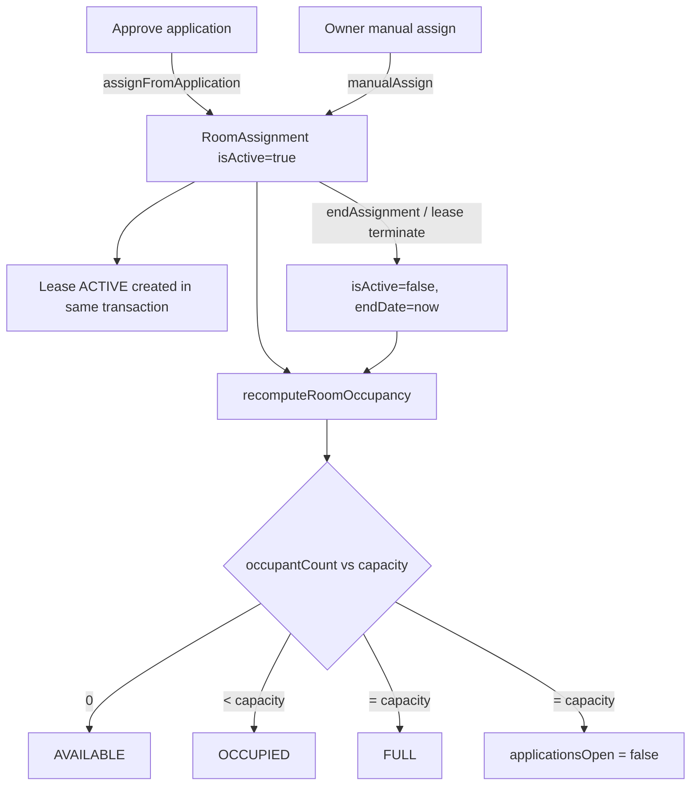

# 07 · Room assignment & roommates

**Actors:** Owner (assign / end), Tenant (view roommates)
**Code:** `backend/src/modules/assignments/*`
**Frontend:** owner sees assignments on `OwnerProperties.tsx` room detail; tenant on `TenantDashboard.tsx`

---

## What an assignment is

`RoomAssignment` links a tenant to a room for a period. It is:

- unique on `(roomId, tenantId, isActive)` — a tenant can't have two active assignments in the same room;
- the source of truth for **occupancy** (`Room.occupantCount`) and **roommates**;
- created either from an approved application ([06](06-owner-review-decision.md)) or directly by the owner.



## Assign from an approved application

Happens automatically inside `POST /owner/applications/:id/decision { decision: APPROVE }`.
`assignFromApplication` runs as one transaction:

1. Load application; verify owner owns it and status is `OWNER_REVIEW` / `AI_COMPLETE`.
2. Guard: active occupants `< capacity` → else `409`.
3. Guard: active occupants `< roommatesLimit` → else `409` ("Roommate limit reached").
4. Guard: tenant not already actively assigned to this room → else `409`.
5. Create `RoomAssignment` (`startDate`, `endDate`, `foodOptIn`, `applicationId`).
6. Create `Lease` (`ACTIVE`, `monthlyRent`, `foodCharge` if opted in, `securityDeposit` from room, `rentDueDay`, `terms`).
7. `Application → APPROVED`.
8. Auto-withdraw the tenant's other pending applications for the same room.
9. `recomputeRoomOccupancy`.

## Manual assignment `[OWNER]`

For an already-registered tenant with no application (e.g. a returning tenant).

`POST /owner/rooms/:roomId/assignments`

```json
{
  "tenantId": "cuid...",
  "lease": {
    "startDate": "2026-10-01",
    "endDate": "2027-09-30",
    "rentDueDay": 1,
    "monthlyRent": 12000,
    "foodOptIn": false,
    "terms": "…"
  }
}
```

Guards: owner owns the room; target user has `role = TENANT` (→ `400` otherwise);
capacity / roommate-limit / duplicate checks (same as above). Creates assignment +
lease + recomputes occupancy, notifies the tenant. Audit: `assignment.manual_create`.

Find eligible tenants: `GET /users/tenants?search=` (tenants linked to the owner).

## List assignments for a room `[OWNER]`

`GET /owner/rooms/:roomId/assignments` — active first, then by `startDate` desc, with
tenant contact details.

## Roommates

A tenant's **roommates** = the *other* active assignments in the same room(s).

- Tenant: `GET /tenant/roommates` → `roommatesService.roommatesForTenant` returns
  `{ assignmentId, room, tenant: { id, fullName, phone }, startDate, foodOptIn }` for each co-tenant.
- Also surfaced on the tenant dashboard ([17](17-dashboards-analytics.md)).

The **roommates limit** (`Room.roommatesLimit`, ≤ `capacity`) caps how many tenants
can share; enforced at assignment time.

## End an assignment `[OWNER]`

`POST /owner/assignments/:assignmentId/end` — body `{ reason? }`

```
transaction:
  RoomAssignment → isActive = false, endDate = now
  matching ACTIVE Lease(s) → status = TERMINATED
  recomputeRoomOccupancy  (frees the bed; may set room AVAILABLE/OCCUPIED)
Notification → tenant: "Your tenancy for <room> has been ended. Reason: …"
```

Guards: `404` if not found, `403` if not the owner's room, `409` if already ended.
Audit: `assignment.end`. (Terminating the lease directly does the equivalent — see [08](08-leases.md).)

## Edge cases

| Situation | Result |
| --- | --- |
| Approve/assign when room is full | `409`, whole transaction rolls back |
| Approve/assign when roommate limit reached (but capacity spare) | `409` |
| Assign the same tenant to the same room twice | `409` |
| Manual-assign a non-tenant user | `400` |
| Room hits capacity on assignment | `applicationsOpen` auto-set to `false` |
| End an already-ended assignment | `409` |
| End assignment → room had 1 occupant | room → `AVAILABLE`, bed freed |
