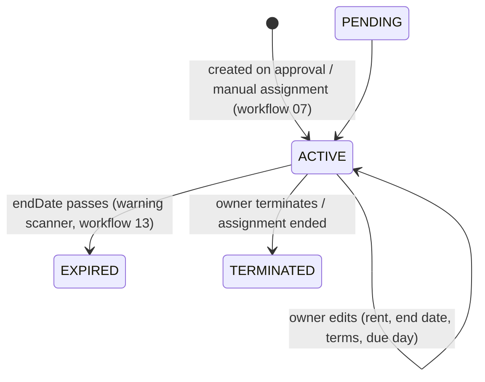

# 08 · Leases

**Actors:** Owner (manage), Tenant (view)
**Code:** `backend/src/modules/leases/*`
**Frontend:** `frontend/src/pages/owner/OwnerLeases.tsx`, `frontend/src/pages/tenant/TenantDashboard.tsx`

---

## Lifecycle



A `Lease` is **created automatically** when an application is approved or a tenant is
manually assigned — never created via a standalone endpoint. It carries
`monthlyRent`, `foodCharge`, `securityDeposit`, `rentDueDay` (1–28), `startDate`,
`endDate`, `terms`, `status`, and an optional `aiSummary` + `aiSummarySource`.

## Owner endpoints `[OWNER]`

| Endpoint | Notes |
| --- | --- |
| `GET /owner/leases?status=&roomId=&tenantId=&expiringBefore=&page=` | ordered by `endDate` asc; each row has tenant, room+property, payment count |
| `GET /owner/leases/:id` | full detail incl. all payments (newest period first) |
| `PATCH /owner/leases/:id` | update `endDate`, `monthlyRent`, `foodCharge`, `securityDeposit`, `rentDueDay`, `status`, `terms`. Audit `lease.update` |
| `POST /owner/leases/:id/terminate` | see below. Audit `lease.terminate` |
| `POST /owner/leases/:id/summarize` | AI lease summary (rate-limited). |

All guarded by `ownerLeaseOrThrow` → `404` / `403`.

### Terminate

```
transaction:
  Lease → status = TERMINATED
  matching active RoomAssignment(s) → isActive = false, endDate = now
  Room occupantCount / status recomputed  (bed freed)
```

Equivalent to ending the assignment ([07](07-assignment-roommates.md)) from the lease side.

### AI lease summary

`POST /owner/leases/:id/summarize` → `aiClient.summarizeLease` → AI service
`POST /ai/summarize-lease` (**NVIDIA first, rule-based fallback** — [16](16-ai-fallback.md)).

Response `{ source, summary, keyPoints[], obligations[] }`. The `summary` and its
`source` are persisted onto the lease (`aiSummary`, `aiSummarySource`) and shown with a
**NVIDIA AI** / **Rule-Based Fallback** tag.

Fallback summary is templated from the lease fields:

```
Lease for Room 101 at Maple Residency running 2026-10-01 to 2027-09-30.
Monthly rent ₹15000 plus ₹3000 food charge, due on day 5 of each month.
Security deposit ₹30000.
keyPoints:  Term, Monthly rent (+food), Rent due day, Security deposit, Additional terms
obligations: Pay rent by the due day; give notice before vacating; keep the room in good
             condition; report maintenance promptly
```

## Tenant endpoints `[TENANT]`

| Endpoint | Notes |
| --- | --- |
| `GET /tenant/leases` | all the tenant's leases, newest first, with room+property |
| `GET /tenant/leases/:id` | full detail incl. payments; `404` if not the tenant's |

The tenant dashboard shows the active lease's term, monthly rent and food charge.

## Automatic expiry

The hourly warning scanner ([13](13-warnings.md)):

- Raises a `LEASE_EXPIRY` warning when an `ACTIVE` lease ends within 30 days
  (severity by days remaining: ≤7 `HIGH`, ≤14 `MEDIUM`, else `LOW`).
- Sets any `ACTIVE` lease whose `endDate` is already past to `EXPIRED`.

## Relationship to payments

`rentDueDay`, `monthlyRent` and `foodCharge` on the lease drive invoice generation
in [09](09-rent-payments.md): `Payment.dueDate = <periodYear>-<periodMonth>-<min(rentDueDay,28)>`,
`totalAmount = monthlyRent + foodCharge (+ otherAmount)`.

## Edge cases

| Situation | Result |
| --- | --- |
| Reduce `endDate` to the past via PATCH | allowed; next scan marks it `EXPIRED` |
| Terminate a lease | assignment ended, bed freed, tenant notified |
| Summarize when the AI service is down | `RULE_BASED_FALLBACK` summary; still saved |
| Tenant requests another tenant's lease | `404` |
| Edit `rentDueDay` to 31 | `400` (max 28, to keep month arithmetic safe) |
