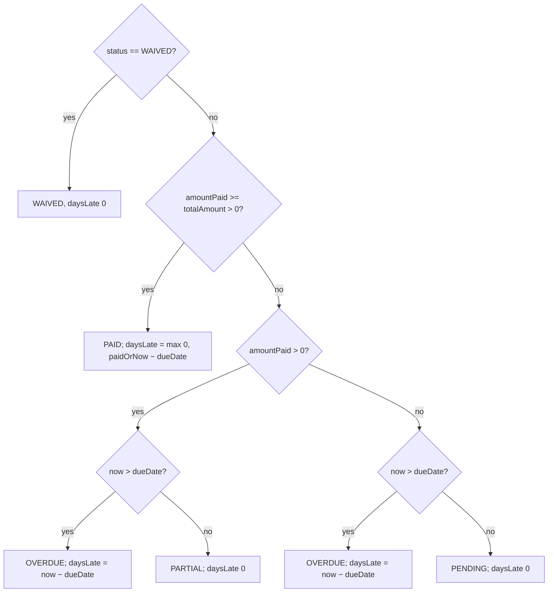

# 09 · Rent & payments

**Actors:** Owner (generate invoices, record payments, adjust/waive), Tenant (pay, view history)
**Code:** `backend/src/modules/payments/*` — see `derivePaymentState`
**Frontend:** `frontend/src/pages/owner/OwnerPayments.tsx`, `frontend/src/pages/tenant/TenantPayments.tsx`

---

## The `Payment` record

One row per `(lease, year, month)` — **unique constraint** makes generation idempotent.

| Field | Meaning |
| --- | --- |
| `rentAmount`, `foodAmount`, `otherAmount` | components |
| `totalAmount` | `rent + food + other` |
| `amountPaid` | cumulative received |
| `dueDate` | `<year>-<month>-<min(lease.rentDueDay, 28)>` |
| `paidDate` | set when fully paid |
| `daysLate` | computed, see below |
| `status` | `PENDING` / `PARTIAL` / `PAID` / `OVERDUE` / `WAIVED` |
| `method`, `reference`, `notes` | payment metadata |

## `derivePaymentState` — the status/late-days rule



`daysLate` for a paid invoice is measured from `paidDate` (or now) to `dueDate`;
for an unpaid one, from now to `dueDate`. This drives repeated-late-payment
warnings ([13](13-warnings.md)).

## Generate invoices `[OWNER]`

| Endpoint | Effect |
| --- | --- |
| `POST /owner/payments/generate` `{ year?, month? }` | for **every active lease** of the owner, create that month's invoice (defaults to current UTC month). Idempotent. Returns `{ period, leases, processed }`. Audit `payment.generate_bulk` |
| `POST /owner/payments/leases/:leaseId/generate` `{ year?, month? }` | one lease. `409` if the lease isn't `ACTIVE`. Audit `payment.generate` |

`generateForPeriod`: returns the existing row if already present; otherwise creates
`PENDING` with `rentAmount`/`foodAmount` from the lease and the computed `dueDate`.

## Record a payment `[OWNER]`

`POST /owner/payments/:id/record`

```json
{ "amount": 14500, "method": "UPI", "reference": "TXN123", "paidDate": "2026-10-04", "notes": "…" }
```

- `amount` must be `> 0` → `400`.
- Waived payments reject with `409`.
- `amountPaid += amount`; `paidDate` set if now fully paid; `status` + `daysLate` recomputed via `derivePaymentState`.
- Notification → tenant ("Payment recorded … Outstanding: X").
- Audit: `payment.record`.

Supports partial payments — call it multiple times; status walks `PENDING → PARTIAL → PAID` (or `OVERDUE` if past due).

## Adjust / waive `[OWNER]`

`PATCH /owner/payments/:id`

```json
{ "otherAmount": 500, "dueDate": "2026-10-10", "status": "WAIVED", "notes": "…" }
```

- `otherAmount` recalculates `totalAmount = rent + food + other`.
- `status: "WAIVED"` → `daysLate = 0`, no further payment expected.
- Any other `status` / `dueDate` → recomputed through `derivePaymentState`.
- Audit: `payment.adjust`.

## Tenant self-pay `[TENANT]`

`POST /tenant/payments/:id/pay` — body `{ amount, method, reference? }`

- `404` if not the tenant's, `403` mismatch, `409` if already `PAID` / `WAIVED`, `400` if `amount <= 0`.
- Same cumulative logic as owner-record; `paidDate` set when fully paid.
- Notification → **owner** ("Tenant made a payment …").
- Audit: `payment.tenant_pay`.

> This records payment *intent* — there is no real payment-gateway integration
> ([ARCHITECTURE.md](../ARCHITECTURE.md#known-simplifications)).

## Views

| Endpoint | Returns |
| --- | --- |
| `GET /owner/payments?status=&tenantId=&leaseId=&overdue=&page=` | rows + a `summary: { billed, collected, outstanding }` aggregate |
| `GET /tenant/payments?status=&page=` | the tenant's payment history, newest period first |

Owner dashboard ([17](17-dashboards-analytics.md)) shows revenue billed/collected/outstanding,
`collectedThisMonth`, `latePayments`, `overduePayments`.

## Warnings raised from payments

The scanner ([13](13-warnings.md)) creates/refreshes:

- `RENT_UPCOMING` — due within 3 days (severity `LOW`)
- `RENT_OVERDUE` — past due (`MEDIUM`, or `HIGH` if > 7 days late)
- `REPEATED_LATE_PAYMENT` — ≥ 2 payments with `daysLate > 0` in the trailing 6 months (`MEDIUM`, `HIGH` at ≥ 4)

Rent warnings auto-resolve once the payment becomes `PAID` / `WAIVED`.

## Edge cases

| Situation | Result |
| --- | --- |
| Generate the same month twice | second call is a no-op, returns the existing row |
| Generate for a terminated/expired lease | per-lease endpoint → `409`; bulk skips non-active leases |
| Record ₹0 or negative | `400` |
| Record against a waived invoice | `409` |
| Partial payment before due date | `PARTIAL`, `daysLate 0` |
| Partial payment after due date | `OVERDUE`, `daysLate` counting |
| Full payment 10 days late | `PAID`, `daysLate = 10` (feeds repeated-late detection) |
| Tenant pays an already-paid invoice | `409` |
