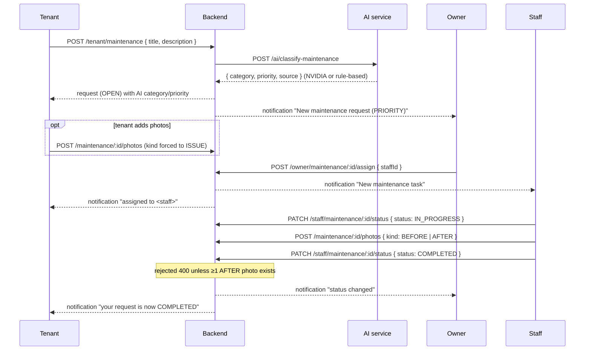

# 10 · Maintenance

**Actors:** Tenant (raise), Owner (classify/assign/manage), Staff (execute)
**Code:** `backend/src/modules/maintenance/*`
**Frontend:** `TenantMaintenance.tsx`, `OwnerMaintenance.tsx`, `StaffMaintenance.tsx`

---

## Full flow

## Status model

`OPEN → ASSIGNED → IN_PROGRESS → COMPLETED` (plus `ON_HOLD`, `CANCELLED`).
Priority: `LOW` / `MEDIUM` / `HIGH` / `URGENT`.

## 1 · Tenant raises a request `[TENANT]`

`POST /tenant/maintenance` — body `{ title (3–160), description (5–4000) }`

- Requires an **active room assignment** → `409` "You are not currently assigned to a room". The room is inferred from that assignment.
- Request created `status = OPEN`.
- Then `aiClient.classifyMaintenance` → AI service `POST /ai/classify-maintenance`
  (**NVIDIA first, rule-based fallback** — [16](16-ai-fallback.md)). Result stored:
  `category`, `priority`, `aiClassification` (raw), `aiSource`.
- Owner notified with the priority in the title.
- Audit: `maintenance.create`.

### AI classification (advisory)

Response `{ source, category, priority, reasoning, suggestedActions[] }`. The owner
can override `priority` / `category` later — the AI only suggests.

**Fallback rules** (`ai-service/app/fallback.py`), first keyword match wins:

| Keywords (sample) | Category | Priority |
| --- | --- | --- |
| gas leak, fire, smoke, sparks, exposed wire, flooding | Safety | `URGENT` |
| no water, burst, sewage, major leak | Plumbing | `HIGH` |
| leak, tap, toilet, drain, clog | Plumbing | `MEDIUM` |
| no power, breaker trips, short circuit | Electrical | `HIGH` |
| socket, switch, bulb, fan not working | Electrical | `MEDIUM` |
| no cooling, AC, heater, HVAC | HVAC | `MEDIUM` |
| lock, door/window broken, can't lock | Security | `HIGH` |
| fridge, stove, washing machine, geyser | Appliance | `MEDIUM` |
| cockroach, rats, termite, bed bug, pest | Pest Control | `MEDIUM` |
| crack, ceiling, seepage, damp, mould | Structural | `MEDIUM` |
| paint, peeling, scratch, hinge | Cosmetic | `LOW` |
| wifi, network, router, broadband | Internet | `MEDIUM` |
| (no match) | General | `MEDIUM` |

Urgency language ("urgent", "emergency", "dangerous", "child", "elderly", …) bumps the priority one level.

## 2 · Photos `[TENANT | STAFF | OWNER]`

`POST /maintenance/:id/photos` — `multipart` `file` + `kind` (`ISSUE` / `BEFORE` / `AFTER`)

- Any of the three roles may post, but the service checks the relationship:
  tenant must own the request, staff must be the assignee, owner must own the property → else `403`.
- **Tenants are always forced to `kind = ISSUE`** regardless of what they send.
- Stored under `uploads/maintenance-photos/`, MIME/size checked; served from `/uploads/<path>`.
- Audit: `maintenance.photo`.

`POST /maintenance/:id/notes` — `{ body }` — same role/relationship check. Audit implied via the row.

## 3 · Owner triage `[OWNER]`

| Endpoint | Effect |
| --- | --- |
| `GET /owner/maintenance?status=&priority=&roomId=&staffId=&page=` | list, priority desc |
| `GET /owner/maintenance/:id` | full detail (photos, notes, assignee) |
| `POST /owner/maintenance/:id/assign` `{ staffId }` | assign a staff member the owner manages (`ownerStaffOrThrow`); `409` if request already closed. `OPEN → ASSIGNED`. Notifies staff + tenant. Audit `maintenance.assign` |
| `PATCH /owner/maintenance/:id` `{ priority?, category?, status? }` | override AI classification or force a status. Audit `maintenance.owner_update` |

## 4 · Staff execution `[STAFF]`

| Endpoint | Effect |
| --- | --- |
| `GET /staff/maintenance?status=&completed=true&page=` | assigned tasks only; by default excludes `COMPLETED`/`CANCELLED` |
| `GET /staff/maintenance/:id` | detail; `403` if not the assignee |
| `PATCH /staff/maintenance/:id/status` `{ status, resolutionNotes? }` | `ASSIGNED` / `IN_PROGRESS` / `ON_HOLD` / `COMPLETED` |
| `POST /maintenance/:id/photos` `{ kind: BEFORE\|AFTER }` | proof photos |

Status transition effects (`staffUpdateStatus`):

- `IN_PROGRESS` → sets `startedAt` (first time only).
- `COMPLETED` → sets `completedAt`, stores `resolutionNotes`, **requires ≥ 1 `AFTER` photo** → `400` "Upload at least one 'AFTER' photo before marking the task complete".
- Every change notifies the **owner** and the **tenant**.
- Audit: `maintenance.staff_status`.

## Warnings

The scanner ([13](13-warnings.md)) raises `MAINTENANCE_DELAY` when a request stays open
past a threshold: `URGENT`/`HIGH` > 2 days, others > 7 days. Severity: `URGENT`→`CRITICAL`,
`HIGH`→`HIGH`, else `MEDIUM`.

## Edge cases

| Situation | Result |
| --- | --- |
| Tenant with no active room raises a request | `409` |
| Tenant posts a `BEFORE` photo | stored as `ISSUE` (forced) |
| Staff marks `COMPLETED` with no `AFTER` photo | `400` |
| Owner assigns a staff member from another owner | `403` |
| Assign an already-completed/cancelled request | `409` |
| Non-assignee staff opens the request | `403` |
| AI service down when raising | classification via `RULE_BASED_FALLBACK` |
| Request open 3 days at `URGENT` | `MAINTENANCE_DELAY` warning, severity `CRITICAL` |
