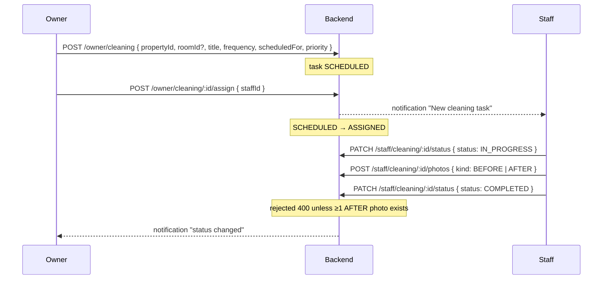

# 11 · Cleaning

**Actors:** Owner (create/assign/manage), Staff (execute)
**Code:** `backend/src/modules/cleaning/*`
**Frontend:** `OwnerCleaning.tsx`, `StaffCleaning.tsx`

---

## Flow



## Status & frequency

Status: `SCHEDULED → ASSIGNED → IN_PROGRESS → COMPLETED` (plus `MISSED`).
Frequency: `ONE_TIME` / `DAILY` / `WEEKLY` / `BIWEEKLY` / `MONTHLY` (descriptive; the
scheduler does not auto-create recurrences — the owner creates each task).
Priority: `LOW` / `MEDIUM` / `HIGH` / `URGENT`.

## Create a task `[OWNER]`

`POST /owner/cleaning`

```json
{
  "propertyId": "cuid...",
  "roomId": "cuid... (optional — omit for common-area tasks)",
  "title": "Weekly common-area cleaning",
  "description": "…",
  "frequency": "WEEKLY",
  "scheduledFor": "2026-10-03T00:00:00.000Z",
  "priority": "MEDIUM"
}
```

Guards: owner owns `propertyId`; if `roomId` given it must belong to that property → `400`.
Created `status = SCHEDULED`. Audit: `cleaning.create`.

## Assign `[OWNER]`

`POST /owner/cleaning/:id/assign` — `{ staffId }`

- Staff must be managed by the owner (`ownerStaffOrThrow`).
- `409` if the task is already `COMPLETED` / `MISSED`.
- `SCHEDULED → ASSIGNED`, `assignedAt = now`. Staff notified. Audit `cleaning.assign`.

## Manage `[OWNER]`

`PATCH /owner/cleaning/:id` — `{ title?, description?, scheduledFor?, priority?, status? }`.
Audit `cleaning.owner_update`.

`GET /owner/cleaning?status=&propertyId=&staffId=&page=` — ordered by `scheduledFor` asc,
with property, room, assignee, photos.
`GET /owner/cleaning/:id` — full detail.

## Staff execution `[STAFF]`

| Endpoint | Effect |
| --- | --- |
| `GET /staff/cleaning?status=&completed=true&page=` | assigned tasks; excludes `COMPLETED`/`MISSED` by default |
| `GET /staff/cleaning/:id` | detail; `403` if not the assignee |
| `PATCH /staff/cleaning/:id/status` `{ status, notes? }` | `ASSIGNED` / `IN_PROGRESS` / `COMPLETED` / `MISSED` |
| `POST /staff/cleaning/:id/photos` `{ kind: BEFORE\|AFTER }` | proof; stored `uploads/cleaning-photos/` |

Transition effects (`staffUpdateStatus`):

- `IN_PROGRESS` → sets `startedAt` (first time).
- `COMPLETED` → sets `completedAt`; **requires ≥ 1 `AFTER` photo** → else `400`.
- Owner notified on every change. Audit `cleaning.staff_status` / `cleaning.photo`.

## Warnings & auto-miss

The scanner ([13](13-warnings.md)):

- Raises `CLEANING_DELAY` for any task in `SCHEDULED` / `ASSIGNED` / `IN_PROGRESS`
  whose `scheduledFor` is in the past (severity `HIGH` if ≥ 3 days late, else `MEDIUM`).
- Auto-sets such a task to `MISSED` once it is ≥ 2 days overdue.

## Edge cases

| Situation | Result |
| --- | --- |
| `roomId` not in `propertyId` | `400` |
| Assign staff from another owner | `403` |
| Assign a completed/missed task | `409` |
| Staff completes with no `AFTER` photo | `400` |
| Non-assignee staff opens task | `403` |
| Task 3 days past schedule, still `ASSIGNED` | `CLEANING_DELAY` warning + auto `MISSED` |
