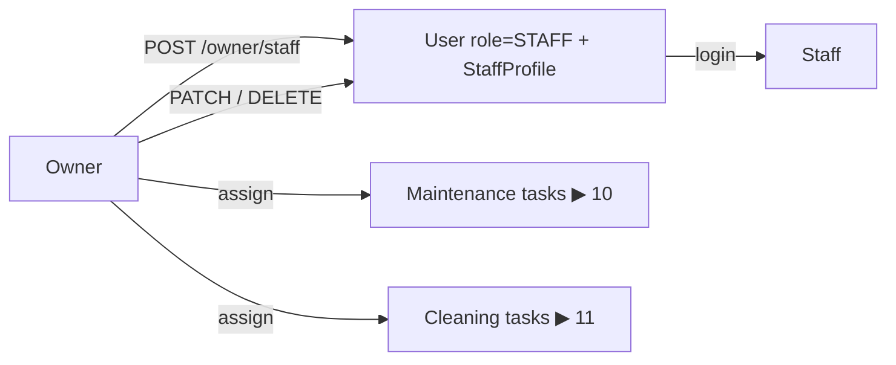

# 12 · Staff management

**Actors:** Owner (create/manage), Staff (self-view)
**Code:** `backend/src/modules/staff/*`
**Frontend:** `frontend/src/pages/owner/OwnerStaff.tsx`

---

## Overview

Staff accounts are **created by an owner** — there is no staff self-registration
([01](01-authentication.md)). A `StaffProfile` links the `User` (`role = STAFF`) to the
owner who manages them and carries `staffType` (`MAINTENANCE` / `CLEANING` / `GENERAL`)
and `skills[]`.



## Create staff `[OWNER]`

`POST /owner/staff`

```json
{
  "email": "maintenance@srms.test",
  "password": "Password123",
  "fullName": "Max Maintenance",
  "phone": "9990004444",
  "staffType": "MAINTENANCE",
  "skills": ["plumbing", "electrical"]
}
```

- Password policy same as registration (8+, upper/lower/digit).
- `409` if the email already exists.
- Creates the `User` + nested `StaffProfile` (`ownerId = caller`), sends the new
  user a welcome notification.
- Audit: `staff.create`.

## List / view `[OWNER]`

| Endpoint | Returns |
| --- | --- |
| `GET /owner/staff?staffType=&isActive=&page=` | each row: contact, `staffType`, `skills`, `isActive`, `openMaintenance`, `openCleaning` counts |
| `GET /owner/staff/:id` | profile + up to 50 recent maintenance & cleaning tasks (`ownerStaffOrThrow` → `403` if not the owner's) |

## Update `[OWNER]`

`PATCH /owner/staff/:id` — `{ fullName?, phone?, staffType?, skills?, isActive? }`

Updates both `StaffProfile` and `User` in a transaction (keeps `staffType` /
`isActive` in sync across the two rows). Audit: `staff.update`.

## Deactivate `[OWNER]`

`DELETE /owner/staff/:id`

Guard: **blocked** (`409`) if the staff member has any open task —
`MaintenanceRequest` not in `COMPLETED`/`CANCELLED` **or** `CleaningTask` not in
`COMPLETED`/`MISSED`. Reassign those first.

On success (transaction):

```
StaffProfile → isActive = false
User → isActive = false
all the user's non-revoked refresh tokens → revoked
```

The next request from that user hits the `isActive` check in `authenticate` → `401`.
Audit: `staff.deactivate`.

## Staff self-view `[STAFF]`

`GET /staff/me` → `staffService.myProfile`:

```json
{
  "id": "...", "email": "...", "fullName": "...", "phone": "...",
  "staffType": "MAINTENANCE",
  "skills": ["plumbing", "electrical"],
  "managedBy": "Olivia Owner",
  "maintenanceCounts": [{ "status": "IN_PROGRESS", "_count": 2 }, ...],
  "cleaningCounts":    [{ "status": "COMPLETED", "_count": 5 }, ...]
}
```

Staff also get `GET /analytics/staff/dashboard` ([17](17-dashboards-analytics.md)) and
their task lists ([10](10-maintenance.md), [11](11-cleaning.md)).

## Edge cases

| Situation | Result |
| --- | --- |
| Create staff with an existing email | `409` |
| Deactivate staff with 3 open maintenance tasks | `409` — "Reassign this staff member's 3 open task(s) before deactivating" |
| Deactivated staff tries to act | `401` on next request (DB `isActive` check) |
| Owner A views owner B's staff | `403` |
| Assign a task to a `GENERAL` staff for cleaning | allowed — `staffType` is advisory for filtering, not enforced at assignment |
