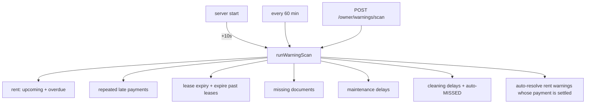

# 13 · Warnings (automatic & manual)

**Actors:** System (scanner), Owner (view / manual / resolve), Tenant (view / acknowledge)
**Code:** `backend/src/modules/warnings/*` — `runWarningScan`, `scheduler.ts`
**Frontend:** `frontend/src/pages/owner/OwnerWarnings.tsx`; tenant sees them on their dashboard

---

## The `Warning` record

| Field | Notes |
| --- | --- |
| `type` | `RENT_UPCOMING`, `RENT_OVERDUE`, `REPEATED_LATE_PAYMENT`, `LEASE_EXPIRY`, `MISSING_DOCUMENTS`, `MAINTENANCE_DELAY`, `CLEANING_DELAY`, `MANUAL` |
| `severity` | `INFO` / `LOW` / `MEDIUM` / `HIGH` / `CRITICAL` |
| `status` | `ACTIVE` / `ACKNOWLEDGED` / `RESOLVED` / `DISMISSED` |
| `tenantId` | the tenant it concerns (null for property-level, e.g. cleaning) |
| `dedupeKey` | **unique** — the scanner refreshes instead of duplicating |
| `autoGenerated` | `true` for scanner output, `false` for manual |
| `relatedType` / `relatedId` | `PAYMENT` / `LEASE` / `APPLICATION` / `MAINTENANCE` / `CLEANING` |

## The scanner

`scheduler.ts` runs `runWarningScan()` ~10 s after boot and hourly. Disable with
`DISABLE_SCHEDULER=true` (used in tests). Each `upsertWarning`:

- if a row with the `dedupeKey` exists and is still `ACTIVE` → refresh `message` + `severity` (no new notification);
- otherwise create it and, if it has a `tenantId`, send a `WARNING` notification.

## What each rule raises

| Rule | Condition | dedupeKey | Severity |
| --- | --- | --- | --- |
| **Rent upcoming** | `Payment` PENDING/PARTIAL/OVERDUE, due within 3 days, not past due | `RENT_UPCOMING:<paymentId>` | `LOW` |
| **Rent overdue** | same but `dueDate < now` | `RENT_OVERDUE:<paymentId>` | `MEDIUM`, or `HIGH` if > 7 days late |
| **Repeated late** | ≥ 2 payments with `daysLate > 0` in trailing 6 months, per tenant | `REPEATED_LATE:<tenantId>:<yyyy-mm>` | `MEDIUM`, `HIGH` at ≥ 4 |
| **Lease expiry** | `ACTIVE` lease ending within 30 days | `LEASE_EXPIRY:<leaseId>` | ≤7d `HIGH`, ≤14d `MEDIUM`, else `LOW` |
| **Missing documents** | `Application` stuck `DOCS_PENDING` > 3 days, missing a required doc | `MISSING_DOCS:<appId>` | `MEDIUM` |
| **Maintenance delay** | open request older than 2 days (`URGENT`/`HIGH`) or 7 days (others) | `MAINT_DELAY:<requestId>` | `URGENT`→`CRITICAL`, `HIGH`→`HIGH`, else `MEDIUM` |
| **Cleaning delay** | task SCHEDULED/ASSIGNED/IN_PROGRESS with `scheduledFor < now` | `CLEAN_DELAY:<taskId>` | ≥3d late `HIGH`, else `MEDIUM` |

Side effects during the scan:

- `ACTIVE` leases with `endDate < now` → set to `EXPIRED`.
- Cleaning tasks ≥ 2 days overdue → set to `MISSED`.
- `ACTIVE` rent warnings whose `Payment` is now `PAID` / `WAIVED` → set to `RESOLVED`.

## Owner endpoints `[OWNER]`

| Endpoint | Effect |
| --- | --- |
| `GET /owner/warnings?status=&type=&tenantId=&page=` | warnings about the owner's tenants + ones the owner issued; ordered ACTIVE first, then severity desc |
| `POST /owner/warnings/scan` | run `runWarningScan` now; returns `{ created, scanned[] }`. Audit `warning.scan` |
| `POST /owner/warnings` `{ tenantId, title, message, severity? }` | **manual** warning (`type = MANUAL`, `autoGenerated = false`); `403` if the tenant isn't linked to the owner's properties; notifies the tenant. Audit `warning.create` |
| `PATCH /owner/warnings/:id/status` `{ status }` | `RESOLVED` / `DISMISSED` / `ACKNOWLEDGED` / `ACTIVE`; sets `resolvedAt` / `acknowledgedAt`. Audit `warning.status` |

## Tenant endpoints `[TENANT]`

| Endpoint | Effect |
| --- | --- |
| `GET /tenant/warnings?status=&page=` | the tenant's own warnings, newest first |
| `PATCH /tenant/warnings/:id/status` `{ status }` | tenants may **only** set `ACKNOWLEDGED` → else `403` |

## Edge cases

| Situation | Result |
| --- | --- |
| Same overdue payment across two scans | one warning, message/severity refreshed, no duplicate notification |
| Tenant pays the overdue rent | next scan auto-`RESOLVED`s the `RENT_OVERDUE` warning |
| Lease `endDate` already past | scan sets lease `EXPIRED` and raises/keeps `LEASE_EXPIRY` |
| Tenant tries to `RESOLVE` their warning | `403` — only `ACKNOWLEDGED` allowed |
| Manual warning for a tenant not linked to the owner | `403` |
| `DISABLE_SCHEDULER=true` | no automatic scans; `POST /owner/warnings/scan` still works |
