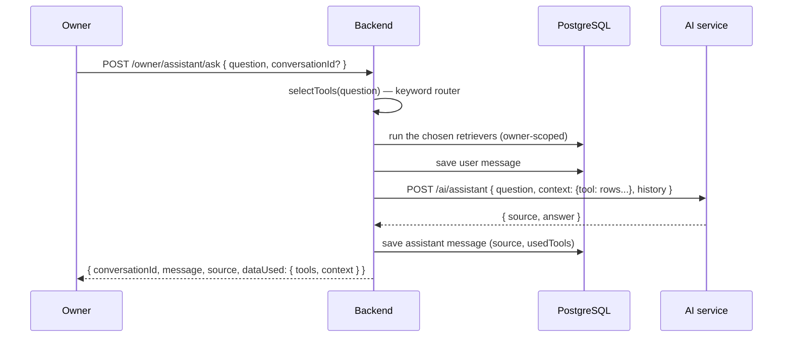

# 15 · Owner AI assistant

**Actors:** Owner
**Code:** `backend/src/modules/assistant/*` — `assistant.tools.ts` (retrievers), `assistant.service.ts`; AI service `POST /ai/assistant`
**Frontend:** `frontend/src/pages/owner/OwnerAssistant.tsx`

---

## Principle

> The assistant answers **only from real database data**, retrieved by
> deterministic backend queries scoped to the owner. It is told, in the system
> prompt, never to invent tenants, rooms, figures or records. On NVIDIA failure it
> falls back to a rule-based formatter over the same data ([16](16-ai-fallback.md)).



## Retrievers (`assistant.tools.ts`)

All owner-scoped, all returning real rows:

| Tool | Returns |
| --- | --- |
| `overdueRent` | `OVERDUE` payments: tenant, room, period, dueDate, daysLate, outstanding |
| `vacantRooms` | rooms with `occupantCount < capacity`: room, property, vacant beds, rent, applicationsOpen |
| `leasesExpiring` | `ACTIVE` leases ending within ~31 days: tenant, room, endDate, daysRemaining |
| `revenueSummary` | totalBilled, totalCollected, outstanding, collectedThisMonth |
| `maintenanceFrequency` | request count grouped by category, sorted desc |
| `pendingApplications` | apps in review: tenant, room, status, AI score + recommendation |
| `occupancyOverview` | per property: rooms, capacity, occupants, occupancyRate |
| `activeWarnings` | active warnings: type, severity, tenant, title, message |

## Keyword router (`selectTools`)

| Question contains… | Tools run |
| --- | --- |
| overdue / late / unpaid / arrears / behind on rent | `overdueRent` |
| vacant / empty / available room / free bed | `vacantRooms` |
| lease / expir / renew / ending | `leasesExpiring` |
| revenue / income / collected / outstanding / financ | `revenueSummary` |
| maintenance / repair / issue / broken / fix | `maintenanceFrequency` |
| application / applicant / approve / screening | `pendingApplications` |
| occupancy / how full / utilisation | `occupancyOverview` |
| warning / alert / risk / flag | `activeWarnings` |
| *(no match)* | `occupancyOverview` + `overdueRent` + `revenueSummary` + `pendingApplications` |

`gatherContext` runs the selected tools in parallel and passes the rows as
`context` to the AI service.

## Endpoints `[OWNER]`

| Endpoint | Effect |
| --- | --- |
| `POST /owner/assistant/ask` `{ question (3–2000), conversationId? }` | creates a conversation if none given (title = first 60 chars); saves the user turn; retrieves data; calls the AI; saves the assistant turn with `source` + `usedTools`. Rate-limited (`aiLimiter`). Audit `assistant.ask` |
| `GET /owner/assistant/conversations` | list, newest first, with message counts |
| `GET /owner/assistant/conversations/:id` | full transcript |
| `DELETE /owner/assistant/conversations/:id` | delete a conversation |

Response:

```json
{
  "conversationId": "…",
  "message": { "role": "assistant", "content": "…", "source": "RULE_BASED_FALLBACK" },
  "source": "RULE_BASED_FALLBACK",
  "model": null,
  "dataUsed": { "tools": ["overdueRent"], "context": { "overdueRent": [ … ] } }
}
```

`dataUsed` is returned for transparency — the UI can show exactly which rows fed the answer.

## Example (rule-based fallback)

> **Q:** "Which tenants have overdue rent?"

```
**Overdue rent** — 1 tenant(s), ₹18,000 outstanding:
- Tina Tenant (Room 101): ₹18,000, 33 days late (period 8/2025)

_Answered from your live database via the rule-based assistant (NVIDIA AI unavailable)._
```

The five sample prompts on the UI:
"Which tenants have overdue rent?", "Which rooms are vacant?",
"Which leases expire this month?", "What is my total revenue?",
"Which maintenance issue occurs most often?"

## Edge cases

| Situation | Result |
| --- | --- |
| NVIDIA key set and working | `source: NVIDIA_AI`, model answers from the same `context` |
| NVIDIA unavailable / empty answer | `source: RULE_BASED_FALLBACK`, deterministic formatter over `context` |
| AI service unreachable | backend `aiClient` last-resort message; still `RULE_BASED_FALLBACK` |
| Question about data with no matching tool | broad snapshot (occupancy + overdue + revenue + pending apps) |
| Non-owner calls the endpoint | `403` |
| Question > 2000 chars | `400` validation |
