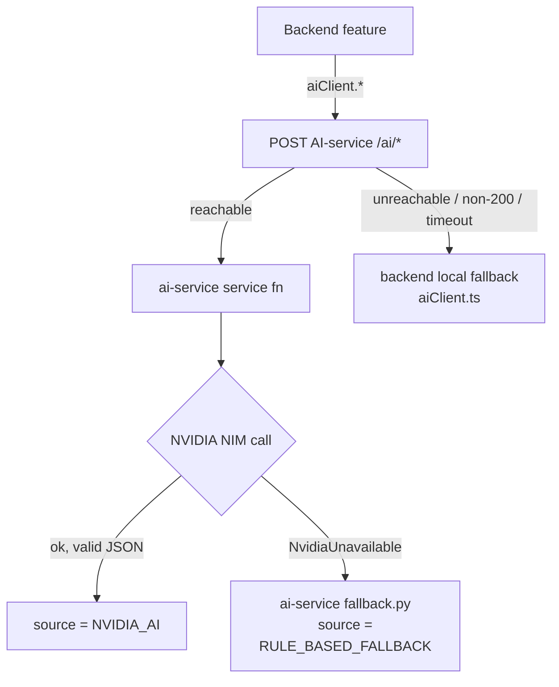

# 16 · AI fallback (NVIDIA → rule-based)

**Actors:** System / AI service
**Code:** `ai-service/app/nvidia_client.py`, `services.py`, `fallback.py`, `prompts.py`; backend `backend/src/lib/aiClient.ts`

---

## Two layers of fallback



1. **AI service level** (`services.py`): every function tries NVIDIA NIM, and on
   `NvidiaUnavailable` calls the matching `fallback.*`. This is the primary,
   feature-rich fallback.
2. **Backend level** (`aiClient.ts`): if the AI *service itself* is down (connection
   refused, timeout via `AI_SERVICE_TIMEOUT_MS`, non-2xx), each `aiClient` method
   catches and returns a minimal local fallback so the calling workflow never breaks.

## What counts as "NVIDIA unavailable" (`nvidia_client.py`)

`chat_json` raises `NvidiaUnavailable` on any of:

| Cause | Detail |
| --- | --- |
| No API key | `NVIDIA_NIM_API_KEY` empty |
| Rate limited | HTTP `429` |
| Upstream error | HTTP `5xx` |
| Request rejected | HTTP `4xx` (no retry — won't help) |
| Network error | timeout / transport error (after `AI_MAX_RETRIES`) |
| Malformed response | missing `choices[0].message.content`, or content isn't parseable JSON |

Requests use `response_format: {type: "json_object"}` and `AI_REQUEST_TIMEOUT`
(default 15 s). One retry on network errors (`AI_MAX_RETRIES`).

## The `source` field — always present

Every AI response (eligibility, doc verification, summaries, maintenance
classification, assistant, insights) carries:

```
source: "NVIDIA_AI" | "RULE_BASED_FALLBACK"
```

The backend persists it (`AiResultSource` enum on `EligibilityAssessment`,
`DocVerificationResult`, `ApplicationSummary`, `MaintenanceRequest.aiSource`,
`Lease.aiSummarySource`, `AiMessage.source`). The frontend renders it as a badge:

- **`NVIDIA AI`** — green
- **`Rule-Based Fallback`** — amber

Shown on: application detail (eligibility / docs / summary), applications list,
maintenance rows, lease summary, assistant messages, owner dashboard insights, and
the header (`AI: NVIDIA` / `AI: Rule-Based` from `GET /ai/status`).

## Criteria match vs. approval probability

For **eligibility**, the two sources mean different things by the number:

| Source | `scoreLabel` | Meaning |
| --- | --- | --- |
| `NVIDIA_AI` | `"Advisory score"` | model's advisory assessment, 0–100 |
| `RULE_BASED_FALLBACK` | `"Criteria Match"` | **how well the applicant matches letting criteria** — *not* a probability of approval |

```
NVIDIA AI unavailable
        ↓
Keyword + rule matching
        ↓
Criteria Match: 82%
```

Either way it is **advisory** — the owner decides ([06](06-owner-review-decision.md)).

## Advisory-only guardrail (`prompts.py`)

Every screening/assistant prompt begins with `ADVISORY_GUARD`:

> "You must NEVER state or imply a final approve or reject decision. You only
> provide an advisory assessment. The human owner always makes the final decision.
> Respond with a single valid JSON object and nothing else."

Outputs are also validated/clamped in `services.py` (score 0–100, enums coerced to
valid values) before returning.

## Checking the current mode

`GET /ai/status` `[authenticated]`:

```json
{
  "aiServiceReachable": true,
  "nvidiaConfigured": false,
  "effectiveMode": "RULE_BASED_FALLBACK"
}
```

`GET /health` on the AI service itself reports `nvidiaConfigured` and the model name.

## Enabling NVIDIA

Set in `ai-service/.env`:

```
NVIDIA_NIM_API_KEY=nvapi-...
NVIDIA_NIM_BASE_URL=https://integrate.api.nvidia.com/v1
NVIDIA_NIM_MODEL=meta/llama-3.1-70b-instruct
```

Restart the AI service. No backend change needed — the `source` field starts
reporting `NVIDIA_AI` when calls succeed, and automatically reverts to
`RULE_BASED_FALLBACK` per-call on any failure.

## Edge cases

| Situation | Result |
| --- | --- |
| Key set but quota exhausted | `429` → `RULE_BASED_FALLBACK` for that call |
| Model returns prose instead of JSON | `_extract_json` tries to salvage a `{...}`; if it can't → fallback |
| AI service process down | backend `aiClient` local fallback; workflows still complete |
| Intermittent NVIDIA errors | per-call decision — some results `NVIDIA_AI`, some `RULE_BASED_FALLBACK` |
| Owner re-runs screening after fixing the key | fresh results, now `NVIDIA_AI` |
