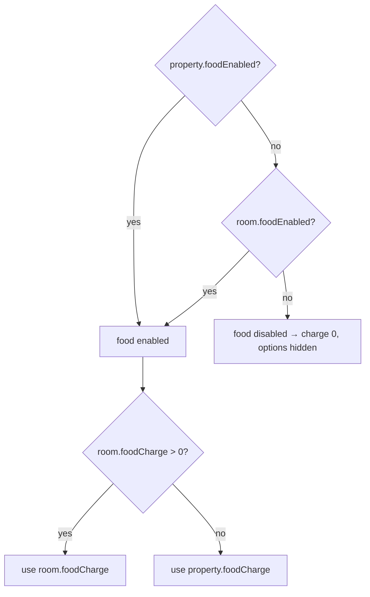

# 18 · Food option

**Actors:** Owner (configure), Tenant (opt in)
**Code:** `backend/src/modules/rooms/rooms.service.ts` → `effectiveFood`; used across applications, assignments, leases, payments, analytics

---

## The rule

Food is optional and owner-controlled, at **two levels**:

```
effectiveFoodEnabled = property.foodEnabled  OR  room.foodEnabled
effectiveFoodCharge  = effectiveFoodEnabled
                         ? (room.foodCharge || property.foodCharge)
                         : 0
```

`effectiveFood(room, property)` is the single helper that computes this everywhere.



## Configuring `[OWNER]`

- **Property**: `POST/PATCH /owner/properties` → `foodEnabled`, `foodCharge`.
- **Room**: `POST/PATCH /owner/rooms` → `foodEnabled`, `foodCharge` (a room-level override — a room can enable food even if the property doesn't).

## Where "effective food" is used

| Place | Behaviour when enabled | When disabled |
| --- | --- | --- |
| `GET /tenant/rooms` / `:id` browse | returns `food: { foodEnabled: true, foodCharge }` | `food: { foodEnabled: false, foodCharge: 0 }` |
| Apply (`POST /tenant/applications`) | `foodOptIn` honoured | `foodOptIn` forced to `false` |
| Approve / manual assign | `foodOptIn = lease.foodOptIn ?? application.foodOptIn` (only if enabled) | always `false` |
| `Lease.foodCharge` | `effectiveFoodCharge` if the tenant opted in, else `0` | `0` |
| Invoice generation ([09](09-rent-payments.md)) | `Payment.foodAmount = lease.foodCharge`; `totalAmount = rent + food` | `foodAmount = 0` |
| Tenant dashboard ([17](17-dashboards-analytics.md)) | `food: { enabled: true, charge, optedIn }` | `food: { enabled: false, charge: 0, optedIn: false }` |
| Frontend | shows the food checkbox on apply, food line on lease/dashboard | food UI hidden entirely |

## Opting in `[TENANT]`

- On the application: `foodOptIn` in the apply body.
- The owner can override at approval time via `lease.foodOptIn`.
- Recorded on both `RoomAssignment.foodOptIn` and reflected in `Lease.foodCharge`.

Once set at approval, changing a tenant's food opt-in means editing the lease
(`PATCH /owner/leases/:id` with a new `foodCharge`) — future invoices pick it up.

## Edge cases

| Situation | Result |
| --- | --- |
| Property food off, room food on, room charge 0 | enabled, charge = property.foodCharge |
| Property food on (₹3000), room food off, room charge ₹2500 | enabled, charge = ₹2500 (room value wins when set) |
| Food disabled everywhere but room has a `foodCharge` value | `effectiveFoodCharge = 0`; no charge added |
| Tenant sends `foodOptIn: true` for a no-food room | stored as `false` |
| Owner enables food on a property after leases exist | existing leases keep `foodCharge = 0` until edited; browse/new applications see it immediately |

Unit-tested in `backend/src/modules/rooms/rooms.service.test.ts`.
